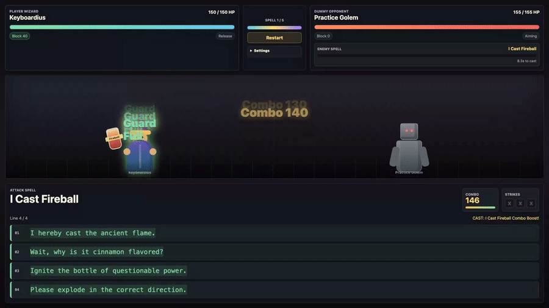
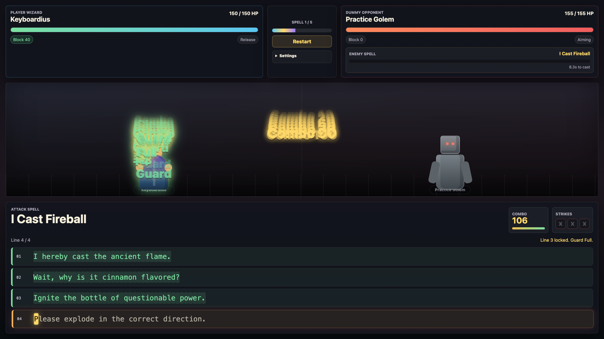
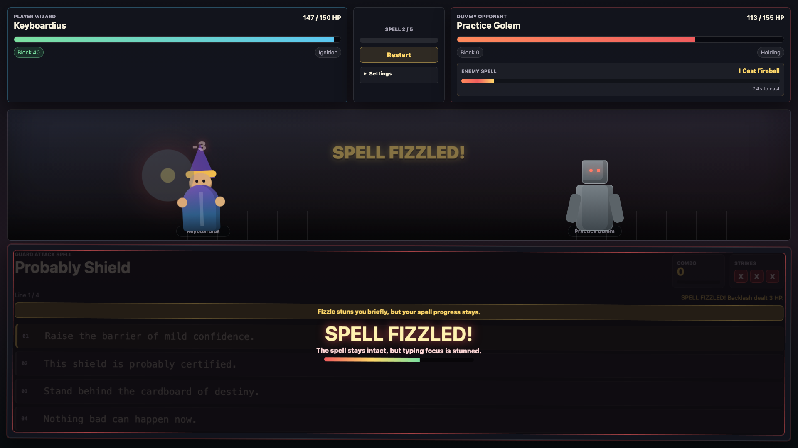

# Typing Wizard Duel



Type ridiculous incantations under pressure—three mistakes can turn a fireball into a fizzle.

**[▶ Play in browser](https://kpetrovski.me/play/typing-wizard-duel/)**





## How to play

- Click **Start Duel**, then type each incantation exactly as shown. Lines advance automatically; do not press Enter between them.
- Finish a spell to cast it. Clean typing builds combo and guard.
- Wrong keys add strikes. **Three strikes** cause a fizzle, backlash damage, and a brief typing stun; spell progress stays.
- Finish a line during an incoming attack warning to resist it.

This is a local single-player duel against a CPU, with no online multiplayer or backend.

## Development

HTML, CSS, vanilla JavaScript; no build step.

Open `index.html` directly, or serve this directory:

```sh
python3 -m http.server 5175
```

[Development, verification, and deployment notes](DEVELOPMENT.md).
